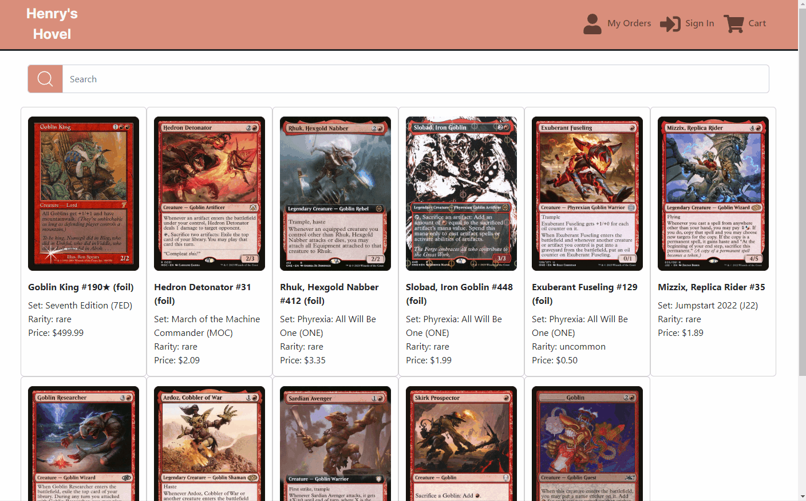

# Henry's Hovel

A full stack e-commerce app for Magic: The Gathering Players to buy and sell cards online.

## Why I Built This

I wanted to build this project to demonstrate my programming skills while combining a personal interest of mine. As a web developer and an avid Magic: The Gathering player, I wanted to create an application that combines my technical expertise with my passion for the game which lets users browse and buy cards and admin users list cards for sale.

## Live Demo

Try the application live at [https://henrys-hovel.azurewebsites.net/](https://henrys-hovel.azurewebsites.net/)
**Note: Please be aware that the website may take a few moments to load initially due to server startup and network latency.**

Once the website is loaded, you can freely navigate and explore its features. If you encounter any issues or have feedback, feel free to reach out.

To simulate a successful payment on the Stripe checkout page, please use one of the test cards from the list found here [https://stripe.com/docs/testing#cards/](https://stripe.com/docs/testing#cards/)

### Technologies Used

- HTML5
- CSS3
- React.js
- Bootstrap 5
- Node.js
- Express
- PostgreSQL
- PGWeb
- Webpack
- Azure
- Figma
- Stripe

## Features

- User can view catalog of cards for sale.
- User can search for cards in catalog.
- User can view detailed information about cards for sale.
- User can add items to their cart.
- User can view their cart.
- User can update quantity of and remove cards from their cart.
- User can sign up for, sign in to, and sign out of accounts.
- User can checkout with stripe.
- User can view their orders and detailed order information.
- Admin user can view inventory of cards for sale.
- Admin user can update inventory of, hide, and remove from inventory specific cards in catalog.
- Admin user can search for cards and add them to inventory.
- Admin user can view orders and detailed order information of users.
- Admin user can mark orders as completed.

## Stretch Features

- User can view and edit their account information.
- User can recieve email notification when order is successful and when order status changes.

## Preview




### System Requirements

- Node.js 18 or higher
- NPM 8 or higher
- PostgreSQL 14 or higher
- Stripe CLI

### Getting Started

1. Clone the repository.

  ```shell
  git clone https://github.com/henryrding/henrys-hovel
  cd henrys-hovel
  ```


2. Install all dependencies with NPM.

  ```shell
  npm install
  ```

3. Import the example database to PostgreSQL.

  ```shell
  npm run db:import
  ```

4. Set up the Stripe CLI for webhooks with Command Prompt.

  ```shell
  stripe login
  stripe status
  stripe listen -- forward-to localhost:3000/webhook
  ```


5. Start the server.

  ```shell
  cd server
  npm run dev
  ```


6. Start PostgreSQL, create a databse, then access the PostgreSQL database using pgweb.

  ```shell
  sudo service postgresql start
  create db henrys-hovel
  pgweb --db=henrys-hovel
  ```


7. Create a .env file in server/ from .env.example. In the `DATABASE_URL` value, replace changeMe` with the name of your database from the last step.

  ```shell
  cp server/.env.example server/.env
  ```


8. Start the client. Once started, you can view the application by opening http://localhost:3000 in your browser.

  ```shell
  cd client
  npm start
  ```
